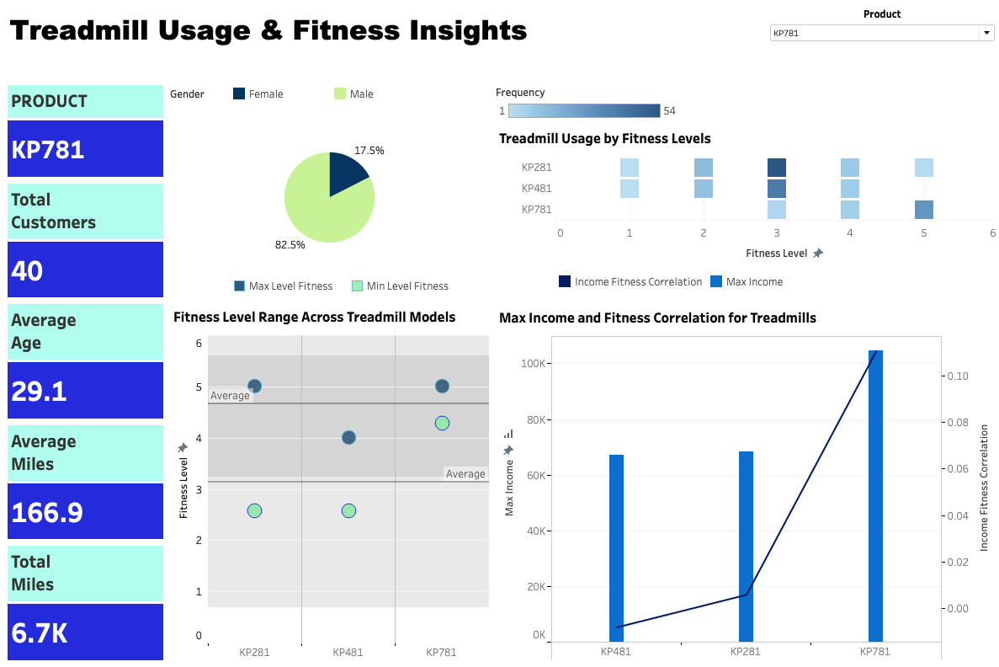

# Treadmill Product Data Analysis

## Overview

This repository contains an analysis of treadmill product data using PostgreSQL for data processing and Tableau for data visualization. The goal of this analysis was to uncover insights into customer demographics, fitness levels, and treadmill usage patterns to inform business and marketing strategies.

## Key Insights

### Fitness Levels and Treadmill Usage

- KP781 Users Achieve Highest Fitness Levels: The KP781 treadmill is used by individuals with the widest range of fitness levels, achieving the highest maximum fitness level among all models.

- KP481 Caters to Lower Fitness Ranges: The KP481 model is primarily used by individuals at the lower end of the fitness spectrum, making it a preferred choice for beginners or those with lower fitness goals.

Treadmill Model Aligns with Fitness Level:

- KP481 users have the lowest fitness levels.

- KP281 users fall in the mid-range.

- KP781 users have the highest fitness levels.

### Demographics and Customer Behavior

KP281 Attracts Younger Customers with Moderate Usage: The KP281 treadmill has the youngest average customer age (28.6 years) and moderate average mileage (82.79 miles), indicating a preference among younger users for regular, but not excessive, workouts.

KP481 Users Maintain Consistent Mileage with Slightly Older Age: The KP481 treadmill users have a slightly older average age (28.9 years) and maintain a steady average mileage (87.93 miles).

### Customer Count and Total Mileage

#### High Customer Count Drives Significant Total Mileage:

The KP281 has the highest customer count (80), resulting in a substantial total mileage of 6.6K.

The KP481 has a lower customer count (60), leading to a smaller total mileage of 5.3K.

### Income and Treadmill Preferences

#### Income Drives Treadmill Choice:

- Higher-income customers prefer the premium KP781 model.

- Lower-income customers favor the budget-friendly KP481.

- The KP281 falls between the two in terms of both price and user demographics.

Positive Income-Fitness Link: Higher-income individuals exhibit a stronger correlation between income and fitness level, reinforcing the link between financial status and treadmill selection.

## Business Recommendations

### Targeted Marketing is Key:

- KP781: Market with premium messaging targeting affluent customers. (more popular among male users)

- KP281: Highlight value and versatility to appeal to mid-range buyers.

- KP481: Emphasize affordability and accessibility for budget-conscious consumers.

Further Analysis: Exploring additional factors such as demographics, usage patterns, and fitness goals can refine customer segmentation and enhance product development strategies.

## Tools Used

PostgreSQL: Data processing and analysis

Tableau: Data visualization and reporting

 

[Tableau Dashboard](https://public.tableau.com/views/treadmill_analysis/Dashboard?:language=en-US&publish=yes&:sid=&:redirect=auth&:display_count=n&:origin=viz_share_link)

